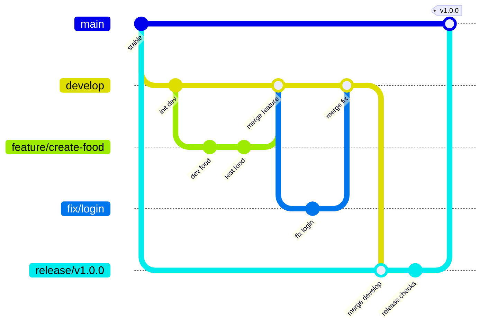
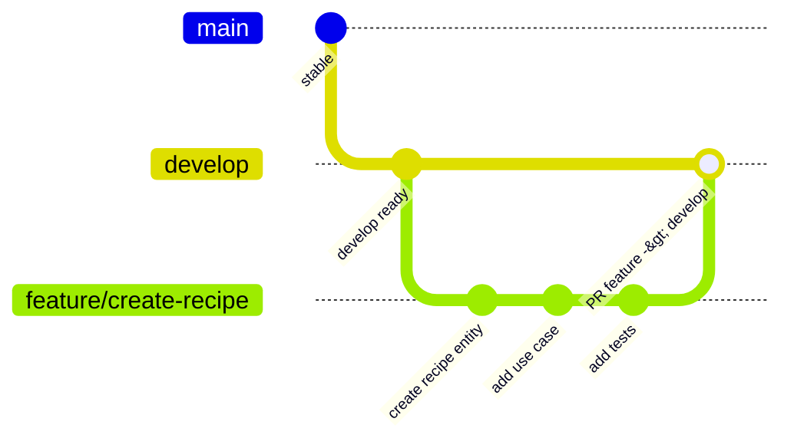
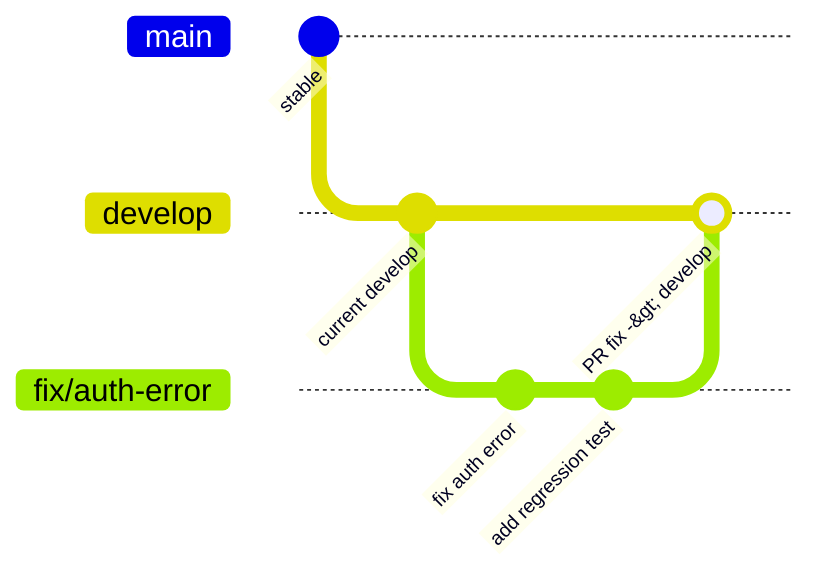
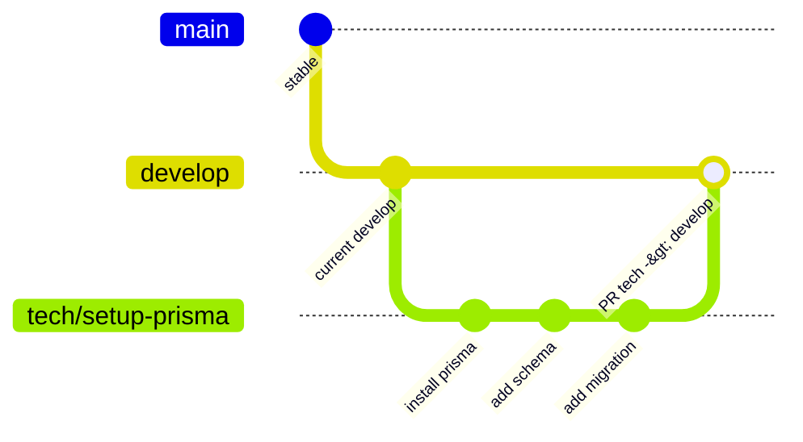
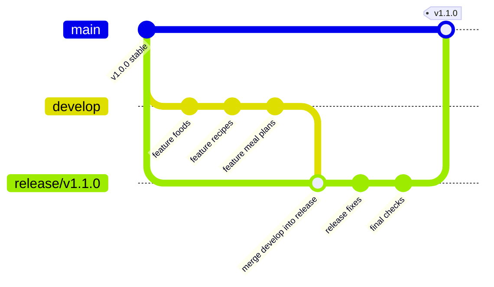
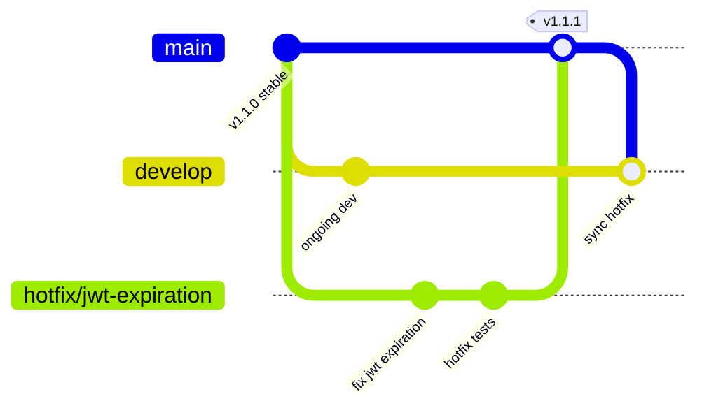

# Git Workflow — Food Manager

## Objectif

Définir un workflow Git commun pour les repositories **food-manager-front** et **food-manager-back**.

> Le repository **food-manager-docs** conserve une unique branche `main` et n'utilise pas ce workflow.

---

## Branches

### Branches permanentes

| Branche | Rôle |
|---|---|
| `main` | Dernière version stable, équivalente production |
| `develop` | Branche d'intégration des développements |

### Branches temporaires

```txt
feature/US-<CODE>-<nom-feature>
fix/US-<CODE>-<nom-correctif>
tech/US-<CODE>-<nom-technique>
release/vX.Y.Z
hotfix/<nom-hotfix>
```

Exemples :

```txt
feature/US-FOOD-001-create-food
feature/US-RECIPE-001-create-recipe
fix/US-FOOD-004-fix-ingredient-update
tech/US-DATA-001-setup-prisma
release/v1.0.0
hotfix/jwt-expiration
```

> Quand une User Story existe, son identifiant doit être inclus dans le nom de la branche pour garder un traçage simple entre le ticket et le développement.

---

## Vue globale du workflow



---

## Développement d'une feature

Une nouvelle fonctionnalité part de `develop`, puis revient dans `develop` via une Pull Request.



### Étapes

1. Se positionner sur `develop`.
2. Créer une branche `feature/*`.
3. Développer et commit.
4. Ouvrir une Pull Request vers `develop`.
5. Laisser GitHub Actions lancer les checks.
6. Merger dans `develop` quand tout est validé.

---

## Correctif hors production

Un correctif non urgent part aussi de `develop`.



---

## Tâche technique

Une tâche technique part de `develop`, comme une feature classique.



---

## Préparation d'une release

Dans ce workflow, la branche de release est créée depuis `main`, puis `develop` est mergée dans la release.



### Étapes

1. Créer `release/vX.Y.Z` depuis `main`.
2. Merger `develop` dans `release/vX.Y.Z`.
3. Lancer les checks de release.
4. Faire les corrections mineures si besoin sur la release.
5. Merger `release/vX.Y.Z` dans `main`.
6. Créer un tag `vX.Y.Z`.
7. Resynchroniser `develop` avec `main`.

---

## Hotfix production

Un hotfix sert uniquement à corriger rapidement un problème en production.



### Étapes

1. Créer `hotfix/*` depuis `main`.
2. Corriger le problème.
3. Merger dans `main`.
4. Créer un tag correctif.
5. Merger `main` dans `develop`.

---

## Règles de Pull Request

Toutes les modifications passent par une Pull Request.

Les pushes directs sont interdits sur :

```txt
main
develop
```

Une Pull Request doit respecter les règles suivantes :

- titre clair ;
- lien avec l'issue GitHub si possible ;
- description courte des changements ;
- CI verte ;
- absence de conflit ;
- validation avant merge.

---

## Stratégie de merge

Utiliser **Squash and Merge** pour garder un historique propre.

Exemple :

```txt
feat(food): create food management
```

plutôt qu'une suite de petits commits techniques peu lisibles.

---

## Convention de commits

Le projet utilise **Conventional Commits**.

Exemples :

```txt
feat(food): create food entity
feat(recipe): add recipe creation
fix(auth): refresh token expiration
docs(dat): update architecture
tech(cache): configure redis
refactor(food): simplify nutrition calculation
test(recipe): add unit tests
```

Types principaux :

| Type | Usage |
|---|---|
| `feat` | Nouvelle fonctionnalité |
| `fix` | Correction de bug |
| `docs` | Documentation |
| `tech` | Tâche technique |
| `refactor` | Refactor sans changement fonctionnel |
| `test` | Tests |
| `chore` | Maintenance |

---

## Protections de branches

### `main`

- push direct interdit ;
- Pull Request obligatoire ;
- CI obligatoire ;
- historique linéaire ;
- tag des versions ;
- déploiement uniquement depuis `main` ou depuis un tag.

### `develop`

- push direct interdit ;
- Pull Request obligatoire ;
- CI obligatoire ;
- branche d'intégration.

---

## GitHub Actions

### Pull Request vers `develop`

```txt
npm install
lint
tests
build
```

### Pull Request vers `main`

```txt
npm install
lint
tests
build
build Docker
```

### Tag `vX.Y.Z`

```txt
build Docker
push image
déploiement
```

---

## Versionning

Le projet suit **Semantic Versioning**.

Format :

```txt
vMAJOR.MINOR.PATCH
```

Exemples :

```txt
v1.0.0
v1.1.0
v1.1.1
```
